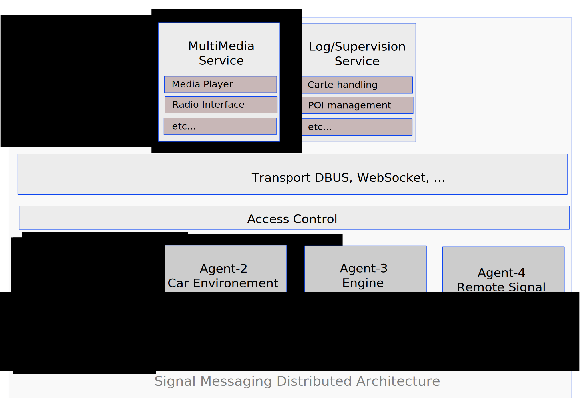
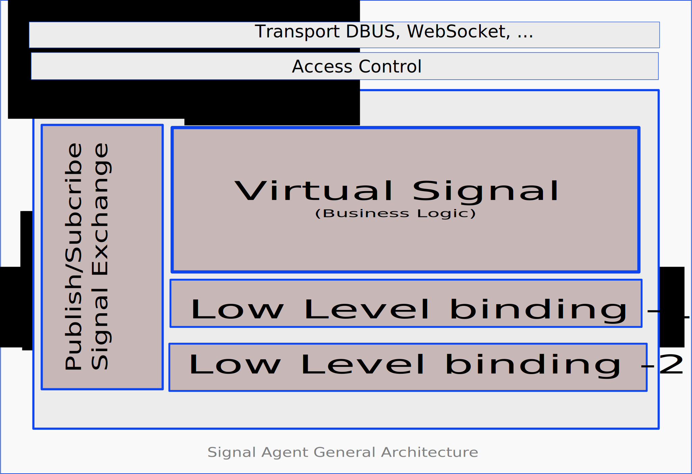
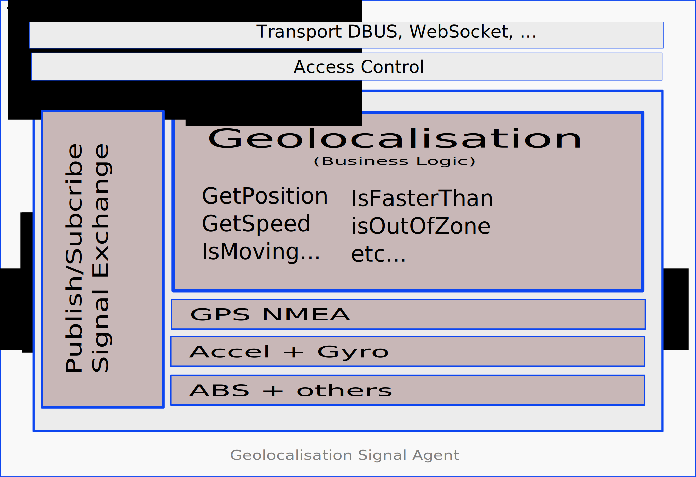

# Message Signaling Potential Architecture for AGL
## Context
Automotive applications need to understand in real time the context in which 
vehicles operate. In order to so it is critical for automotive application to
rely on a simple, fast and secure method to access data generated by the multiple
sensors/ECU embedded in any modern cars.

This signalling problem is neither new, neither unique to the automotive and multiple
solutions often described as Message Broker or Signalling Gateway have been around
for a while. In the context of Linux for Automotive, the "Automotive Message Broker Daemon (aka AMBd)" 
as been around for few years and is pretty well known within the Linux Automotive community.

The present discussion is a proposal to enhance existing signalling/message models.
Our proposal leverages AGL/AppFw [1] binder/bindings model to minimise complexity while keeping
the system fast and secure. Proposing a model with multiple transport options and a full
set of security feature to protect the agent generating the signal as as well as the consuming them.

## Architecture

The proposal leverages AGL/AppFw binder event notification capabilities to
implement a new messaging/signalling model based on distributed agents.
A distributed architecture as as multiple advantage:
- it avoid to concentrate complexity in a single big/fat component.
- it leverage naturally multiple ECU and existing network architecture
- it simplify security by enabling isolation and sandboxing
- it clearly separate responsibility and simplify resolution of conflicts

Each agent exposes to services/applications the signal it is responsible for. Technically an agent is 
a standard AGL/AppFw service. Therefor Signal/Agent inherits of security protection through SMACK, access control through Cynara, transparency of API to transport layer, live cycle management, ...

Like other AGL/AppFw service Signal/Agent is compose of a set of bindings that are assemble into in a an AppFw/Binder. Nevertheless as we will see later in order to improve signal processing performance we propose that Signalling/Binders to be implemented as a special instance of a generic AppFw/Binders.

This model allows to implement low level dependencies within independent bindings. Those bindings when developed are somehow like  like "Lego Bricks" and can be spread or group within one/multiple agents depending on deployment constrains (performance, multi-ECU, security isolation constrains, ...).

## Event Signalling Model

The last AGL/AppFw binding model already includes event notification mechanisms. We propose to reuse those mechanisms as foundation for AGM signal/messaging new design. While previous event notification was limited to basic events (doc 7.10 of [2]) the last work posted on Gerrit [4] proposes a model with a new registration mechanism to allows publish/subscribe implementations (i.e. HellowWorld.c [5]).

The main idea is to implement the low level logic (i.e. CAN handling) as a set of standard AppFw/Bindings. Those low level bindings could then by stack within a shared AppFw/Binder when a virtual signal AppFw/Binding with business logic would then compose all those low level bindings to expose a less hardware dependent vision to applications.

While current AppFw/Binder would technically allow to implement such a model, two major improvements would be welcome. First the amount of exchanged information in between low level bindings and business logic would benefit from a shortcut layer to boost exchanges in between bindings sharing a single binder instance. Secondly a generic set of facilities to handle subscribe registration would deeply simplify the work of developers.

--------- | ---------
 | 

## Security Model

Nothing special as Signal/Agents are standard AppFw/Services they inherit from all protection provided by the AppFw, each Agent run with its own SMACK label and fine grain access control is operated automatically at transport level through Cynara.

## Composition

An important element for long term maintenance is to keep Signal/Bindings as self contains as possible.  Changing a Low level GPS binding should not have a minimal or better no impact at all on existing virtual signal (i.e. GeoPosition). On the same way changing the business logic should be transparent to applications.

In order to do so, binding should use a normalised interface to talk with the binder and no direct dependencies in between  bindings should be allow. The proposal is to reuse an interface mechanism equivalent to the one use to provide API transparency to transport layer or the abstraction on event. 

Multi-ECU and Vehicule to Cloud interactions: while this might not be a show stopper for current projects, it is obvious that in the near future Signal/Agent should supported a fully distributed architectures. Somme event may come from the cloud (i.e. start monitoring this feature), some may come SmartCity and near by vehicules, and last but least some may come from an other ECU within the vehicule or from a virtualise OS within the same ECU (I.e. cluster & IVI). In order to do so not only Bindings should be able to be recomposed within one or multiple binders within the same ECU, but they should also support chaining with the outside world.

1. Application request Virtual Signal exactly like if it was low level signal
2. Agent Signal has direct to low level signal
3. Agent need to proxy to an other agent to get the signal
4. Signal is not present on this ECU, request has to be proxy to the outside world

## Work to be Done

As stated before the foundation for event signalling is already in place in development branch of AppFw/Binder. Nevertheless in order to provide a reel added value to developers missing components should be developed.

- **Agent Core Components**
    - Create a simple configuration model to move from low level signal description to something more generic that could help to abstract the hardware.
    - Implement a real publish subscribe mode on top of existing event model to support advanced functionalities like: getSignalEvery(signal, time), getSignalIf (signal, value, gt, xxx), etc ...
    - Choose a model to boost exchange of information in between binders, MemCache, Retis, ... and implement what ever is necessary on top to provide a real added value to developers.
    - Implement some form of introsception to allow discovery of signal supported by a given agent.
- **Few Common Agents**
    - Having some form of generic CAN agent looks like a minimum
    - Agent simulation, most developers may not have access to physical devices during development phase, some form of simulator would be more than welcome.
    - etc ...

## Reusing existing/legacy code

What ever is the final architecture chosen, it is important not to forget how to leverage existing/legacy code within the new model. While they are multiple source for reusable code, most of them probably fall in two categories:

- **Low Level** Typically those existing code interface with CAN-BUS or any other low level device. Some AMBd[6]plugins could be a good source of input for low level implementation. But also more community oriented projects like: ArduPilot/Rover[7] Barometer or Camera interfaces[8].
- **Virtual Signal** In many cases accessing to low level signal is not enough. Low level information might need to be compose (i.e. GPS+Gyro+Accel) or Signal need to be processed (I.e.: change unit, average on the last xx seconds, ...). Writing this composition logic might be quite complex  and reusing existing library like: LibEkNav for Kalman filtering [9] or Vrgimbal for 3 axes control[10]

## Proposal

In order to start moving forward one option would be to take a concrete example like GeoPositioning service. In order to do so we could use a Porter+Cogent-Extention[11] that support a GPS and a 9 axis sensor. We could  reuse some existing code like the one from Rover[7] to provide a fine grain positioning service and then interface this new GeoPositioning agent with an application like GpsNavi[12] to get a end-to-end demonstrator.

## References

--------------------------| -----------------
**[1, AppFw Overview]**   | *http://iot.bzh/download/public/2016/appfw/01_Introduction-to-AppFW-for-AGL-1.0.pdf*
**[2, AppFw Core]**       | *http://iot.bzh/download/public/2016/appfw/03_Documentation-AppFW-Core-1.0.pdf*
**[3, AppFw Main]**       | *https://gerrit.automotivelinux.org/gerrit/#/q/project:src/app-framework-main*
**[4, AppFw Binder]**     | *https://gerrit.automotivelinux.org/gerrit/#/q/project:src/app-framework-binder*
**[5, Binding Sample]**   | *https://gerrit.automotivelinux.org/gerrit/gitweb?p=src/app-framework-binder.git;a=tree;f=bindings/samples*
**[6, AMBd]**             | *https://github.com/otcshare/automotive-message-broker*
**[7, Ardupilot Rover]**  | *http://ardupilot.org/rover/index.html*
**[8, Ardupilot Lib]**    | *https://github.com/ArduPilot/ardupilot/tree/master/libraries*
**[9, LibEknav]**         | *https://bitbucket.org/jbrandmeyer/libeknav/wiki/Home*
**[10,Vrgimbal 3Axis]**   | *http://ardupilot.org/rover/docs/common-vrgimbal.html*
**[11,Cogent Extention]** | *http://elinux.org/R-Car/Boards/Porter:PEXT01*
**[12,GpsNavi Hitachi]**  | *https://github.com/gpsnavi/gpsnavi*

